# 🚀 NexusFlow - Plataforma de Gestión de Proyectos

<p align="center">
  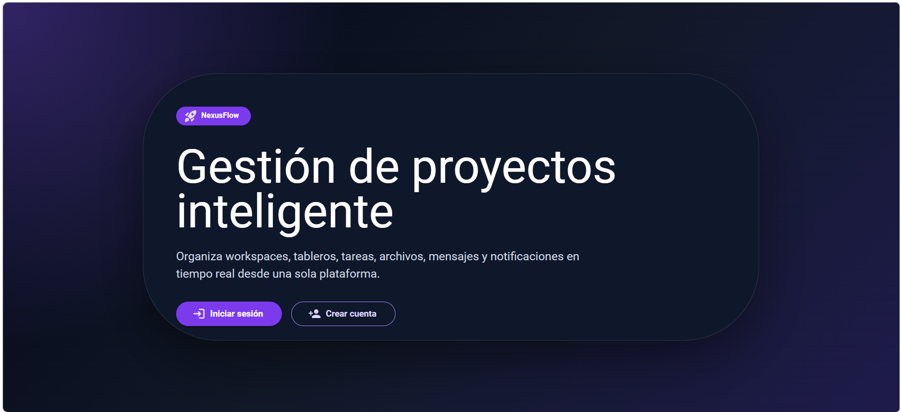
</p>

<p align="center">
  Plataforma moderna de gestión de proyectos basada en microservicios,
  tiempo real y arquitectura escalable.
</p>

---

## Características

- ✅ Gestión de proyectos y tableros
- ✅ Gestión de tareas en tiempo real
- ✅ Sistema de autenticación JWT
- ✅ Microservicios desacoplados
- ✅ WebSockets con Socket.io
- ✅ API Gateway
- ✅ Docker Compose
- ✅ MongoDB
- ✅ Frontend React + Vite
- ✅ Sistema colaborativo multiusuario

---

#  Arquitectura del Proyecto

```bash
NexusFlow/
│
├── frontend/
├── services/
│   ├── api-gateway/
│   ├── auth-service/
│   ├── board-service/
│   ├── task-service/
│   ├── realtime-service/
│   ├── workspace-service/
│   ├── file-service/
│   ├── message-service/
│   └── notification-service/
│
├── docker-compose.yml
└── README.md
```

---

# Tecnologías Utilizadas

## Frontend
- React
- Vite
- Material UI
- Axios
- Socket.io Client

## Backend
- Node.js
- Express.js
- Socket.io
- JWT Authentication
- Microservices Architecture

## Base de Datos
- MongoDB

## DevOps
- Docker
- Docker Compose

---

# Arquitectura de Microservicios

| Servicio | Puerto | Función |
|---|---|---|
| API Gateway | 3000 | Punto de entrada principal |
| Auth Service | 3001 | Autenticación y usuarios |
| Board Service | 3002 | Gestión de tableros |
| Task Service | 3003 | Gestión de tareas |
| File Service | 3004 | Subida de archivos |
| Realtime Service | 3005 | Comunicación tiempo real |
| Message Service | 3006 | Mensajería |
| Notification Service | 3007 | Notificaciones |
| Workspace Service | 3008 | Workspaces |

---

# Instalación con Docker

## Clonar repositorio

```bash
git clone https://github.com/ianovilopez-ops/gestor_proyecto.git
cd nexusflow
```

---

## Variables de entorno

Crear archivo `.env`

```env
MONGO_URI=mongodb://mongo:27017/nexusflow
JWT_SECRET=dev_secret_nexusflow
FRONTEND_URL=http://localhost:5173
NODE_ENV=development
```

---

## Ejecutar proyecto

```bash
docker compose up --build
```

---

# Acceso al Proyecto

| Servicio | URL |
|---|---|
| Frontend | http://localhost:5173 |
| API Gateway | http://localhost:3000 |

---

# Capturas del Sistema

## Dashboard
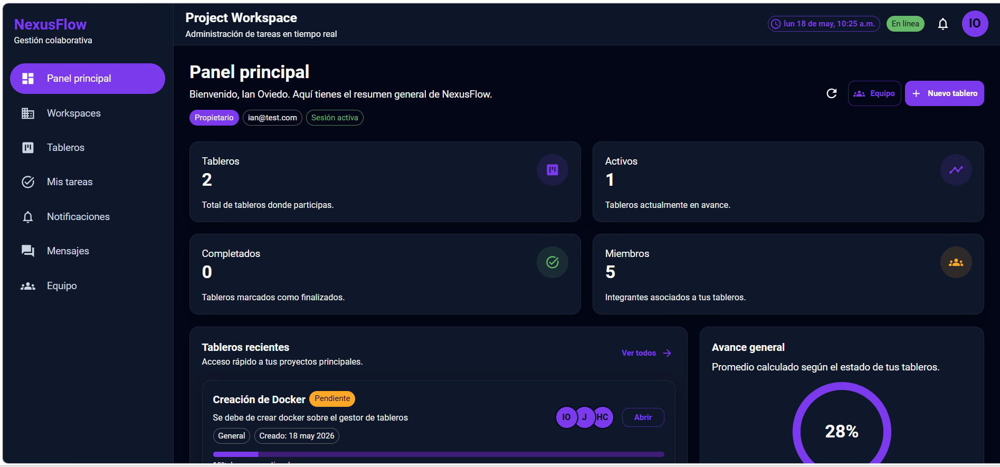

## Tableros
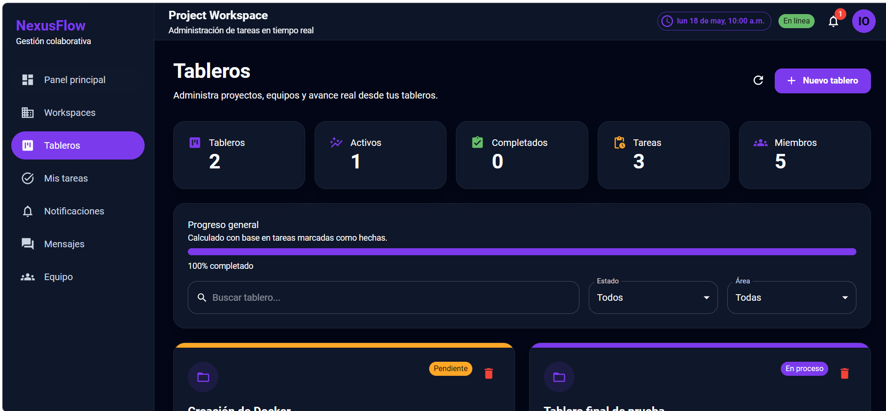

## Mis tareas


## Notificaciones
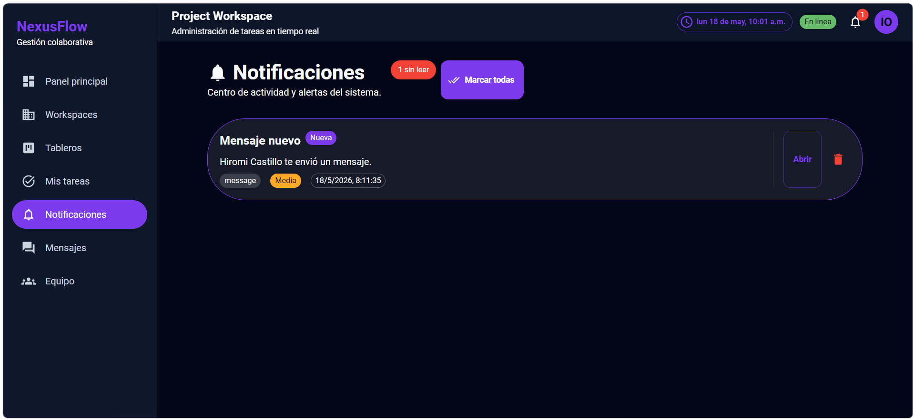

## Mensajes
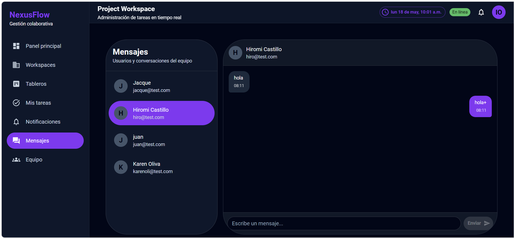

## Equipo
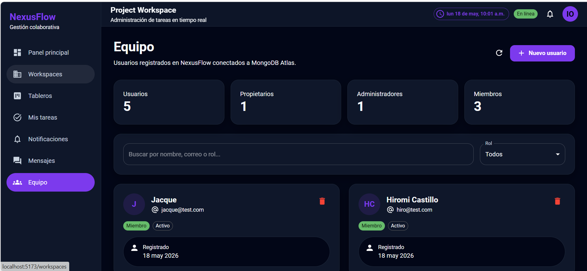

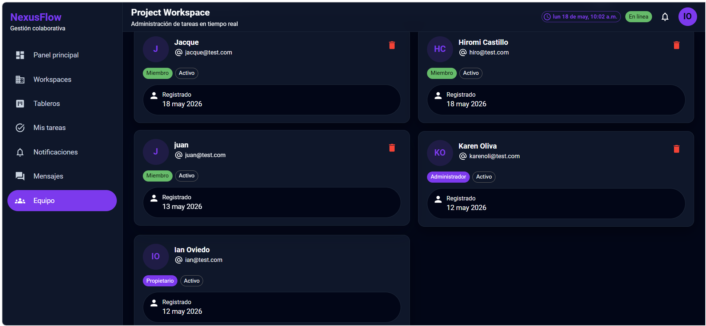

## Ajustes
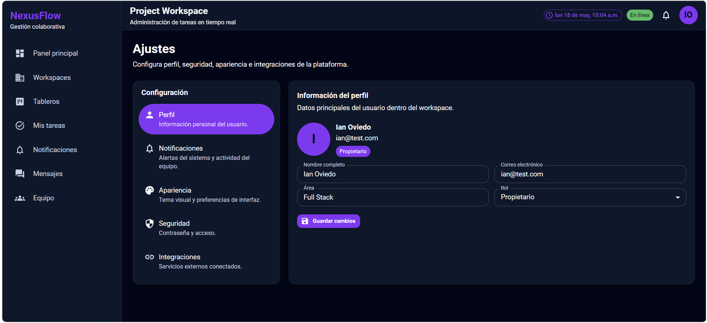


## Ajustes/notificaciones
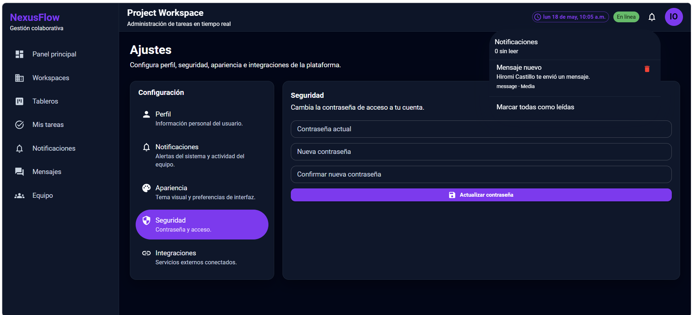

## Ajustes/apariencia
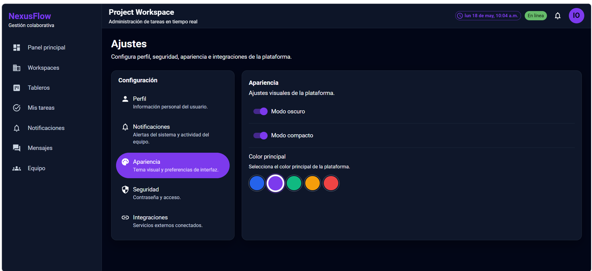

## Ajustes/seguridad
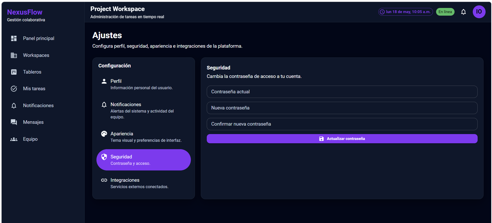

---

# Autenticación

El sistema implementa:

- JWT Authentication
- Roles y permisos
- Middleware de autorización
- Protección de rutas

---

# Comunicación en Tiempo Real

NexusFlow utiliza:

- Socket.io
- WebSockets
- Actualización instantánea de tareas
- Colaboración multiusuario

---

# Docker Services

Para visualizar contenedores:

```bash
docker ps
```

Detener servicios:

```bash
docker compose down
```

---

# Estado del Proyecto

 Proyecto en desarrollo activo.

Funciones futuras:

- Integración con GitHub
- Calendario colaborativo
- Kanban avanzado

---

# Créditos

<table>
  <thead>
    <tr>
      <th align="center">Integrante</th>
      <th align="center">Rol</th>
    </tr>
  </thead>
  <tbody>
    <tr>
      <td>Hiromi Castillo Sandoval</td>
      <td>Desarrollo frontend</td>
    </tr>
    <tr>
      <td>Jacqueline Gomez Estrada</td>
      <td>Desarrollo de backend</td>
    </tr>
    <tr>
      <td>Juan Manuel Juarez Garcia</td>
      <td>Desarrollo backend</td>
    </tr>
    <tr>
      <td>Karen Abigail Oliva Barrera</td>
      <td>Desarrollo fronted</td>
    </tr>
    <tr>
      <td>Ian Alexander Oviedo Lopez</td>
      <td>Lider de proyecto</td>
    </tr>
  </tbody>
</table>

---

# Licencia

Este proyecto es únicamente educativo y de aprendizaje.